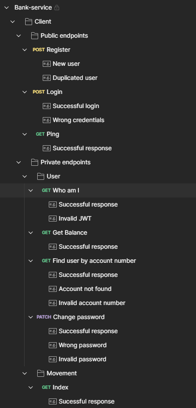

# POST register
    - body
        {
    "first_name": "Jorge",
    "last_name": "Chiquin",
    "document_number": "26141319",
    "birth_date": "2020-05-18T14:40:04.341364Z",
    "phone_number": "+584245186631",
    "email": "jorgechiquinv@gmail.com",
    "password": "Abc123456789!"
}

    - response
        {
    "message": "Usuario registrado con éxito",
    "errors": [],
    "data": {
        "account_number": "01689296550771014900",
        "birth_date": "2020-05-18T14:40:04.341364Z",
        "document_number": "26141319",
        "email": "jorgechiquinv@gmail.com",
        "first_name": "Jorge",
        "last_name": "Chiquin",
        "phone_number": "+584245186631"
    }
}

# Login

    - body
        {
    "email": "elon@gmail.com",
    "password": "12345678"
}

    - response
    {
    "message": "Usuario logueado con éxito",
    "errors": [],
    "data": {
        "account_number": "01689296550771014900",
        "birth_date": "2020-05-18T14:40:04.341364Z",
        "document_number": "26141319",
        "email": "jorgechiquinv@gmail.com",
        "first_name": "Jorge",
        "jwt": "***************",
        "last_name": "Chiquin",
        "phone_number": "+584245186631"
    }
}

# Wo i am
    curl --location 'http://localhost:3000/v1/client/user/whoami' \
--header 'Accept-Language: es'

    - response
        {
    "message": "Usuario validado con éxito",
    "errors": [],
    "data": {
        "account_number": "01689296550771014900",
        "birth_date": "2020-05-18T14:40:04.341364Z",
        "document_number": "26141319",
        "email": "jorgechiquinv@gmail.com",
        "first_name": "Jorge",
        "last_name": "Chiquin",
        "phone_number": "+584245186631"
    }
}

# get balance
    curl --location 'http://localhost:3000/v1/client/user/balance' \
--header 'Accept-Language: es'

    - response
        {
    "message": "Balance obtenido con éxito",
    "errors": [],
    "data": {
        "balance": 5000,
        "last_time": "2023-07-14T01:06:43.8227276Z"
    }
}

# GET Find user by account number

    curl --location 'http://localhost:3000/v1/client/user/account/34567890123456789012' \
--header 'Accept-Language: es'

    - resonse
        {
    "message": "Usuario encontrado con éxito",
    "errors": [],
    "data": {
        "account_number": "34567890123456789012",
        "birth_date": "1989-01-17T00:00:00Z",
        "document_number": "11423344",
        "email": "mia.davis@example.com",
        "first_name": "Mia",
        "last_name": "Davis",
        "phone_number": "+9876543210"
    }
}

# PATCH Change password

    curl --location --request PATCH 'http://localhost:3000/v1/client/user/password' \
--header 'Accept-Language: es' \
--data '{
    "password": "Abc123456789!",
    "new_password": "12345678"
}

    - response
        {
    "message": "Contraseña actualizada con éxito",
    "errors": [],
    "data": null
}

# GET Index
    curl --location 'http://localhost:3000/v1/client/movement?page=1&page_size=20'

    - response
        {
    "message": "Success",
    "errors": [],
    "data": [
        {
            "account_number": "54321098765432109876",
            "amount": 322062,
            "balance": 159523841,
            "created_at": "2023-07-14T04:19:36.408843Z",
            "description": "Bonus",
            "id": 1005,
            "multiplier": -1,
            "updated_at": "2023-07-14T04:19:36.131284Z"
        },
        {
            "account_number": "54321098765432109876",
            "amount": 700570,
            "balance": 159845903,
            "created_at": "2023-07-14T04:19:36.408506Z",
            "description": "Bonus",
            "id": 1004,
            "multiplier": 1,
            "updated_at": "2023-07-14T04:19:36.131284Z"
        },
        {
            "account_number": "54321098765432109876",
            "amount": 544470,
            "balance": 159145333,
            "created_at": "2023-07-14T04:19:36.408166Z",
            "description": "Bonus",
            "id": 1003,
            "multiplier": 1,
            "updated_at": "2023-07-14T04:19:36.131284Z"
        },
        {
            "account_number": "54321098765432109876",
            "amount": 816626,
            "balance": 158600863,
            "created_at": "2023-07-14T04:19:36.407829Z",
            "description": "Bonus",
            "id": 1002,
            "multiplier": -1,
            "updated_at": "2023-07-14T04:19:36.131284Z"
        },
        {
            "account_number": "54321098765432109876",
            "amount": 541218,
            "balance": 159417489,
            "created_at": "2023-07-14T04:19:36.40748Z",
            "description": "Bonus",
            "id": 1001,
            "multiplier": 1,
            "updated_at": "2023-07-14T04:19:36.131284Z"
        },
        {
            "account_number": "54321098765432109876",
            "amount": 656182,
            "balance": 158876271,
            "created_at": "2023-07-14T04:19:36.407121Z",
            "description": "Bonus",
            "id": 1000,
            "multiplier": 1,
            "updated_at": "2023-07-14T04:19:36.131284Z"
        },
        {
            "account_number": "54321098765432109876",
            "amount": 322642,
            "balance": 158220089,
            "created_at": "2023-07-14T04:19:36.406783Z",
            "description": "Bonus",
            "id": 999,
            "multiplier": -1,
            "updated_at": "2023-07-14T04:19:36.131284Z"
        },
        {
            "account_number": "54321098765432109876",
            "amount": 754533,
            "balance": 158542731,
            "created_at": "2023-07-14T04:19:36.406403Z",
            "description": "Bonus",
            "id": 998,
            "multiplier": 1,
            "updated_at": "2023-07-14T04:19:36.131284Z"
        },
        {
            "account_number": "54321098765432109876",
            "amount": 651011,
            "balance": 157788198,
            "created_at": "2023-07-14T04:19:36.406067Z",
            "description": "Bonus",
            "id": 997,
            "multiplier": 1,
            "updated_at": "2023-07-14T04:19:36.131284Z"
        },
        {
            "account_number": "54321098765432109876",
            "amount": 276224,
            "balance": 157137187,
            "created_at": "2023-07-14T04:19:36.405731Z",
            "description": "Bonus",
            "id": 996,
            "multiplier": -1,
            "updated_at": "2023-07-14T04:19:36.131284Z"
        },
        {
            "account_number": "54321098765432109876",
            "amount": 730213,
            "balance": 157413411,
            "created_at": "2023-07-14T04:19:36.405396Z",
            "description": "Bonus",
            "id": 995,
            "multiplier": 1,
            "updated_at": "2023-07-14T04:19:36.131284Z"
        },
        {
            "account_number": "54321098765432109876",
            "amount": 488411,
            "balance": 156683198,
            "created_at": "2023-07-14T04:19:36.405058Z",
            "description": "Bonus",
            "id": 994,
            "multiplier": 1,
            "updated_at": "2023-07-14T04:19:36.131284Z"
        },
        {
            "account_number": "54321098765432109876",
            "amount": 744444,
            "balance": 156194787,
            "created_at": "2023-07-14T04:19:36.404716Z",
            "description": "Bonus",
            "id": 993,
            "multiplier": -1,
            "updated_at": "2023-07-14T04:19:36.131284Z"
        },
        {
            "account_number": "54321098765432109876",
            "amount": 383821,
            "balance": 156939231,
            "created_at": "2023-07-14T04:19:36.404378Z",
            "description": "Bonus",
            "id": 992,
            "multiplier": 1,
            "updated_at": "2023-07-14T04:19:36.131284Z"
        },
        {
            "account_number": "54321098765432109876",
            "amount": 513237,
            "balance": 156555410,
            "created_at": "2023-07-14T04:19:36.404034Z",
            "description": "Bonus",
            "id": 991,
            "multiplier": 1,
            "updated_at": "2023-07-14T04:19:36.131284Z"
        },
        {
            "account_number": "54321098765432109876",
            "amount": 495590,
            "balance": 156042173,
            "created_at": "2023-07-14T04:19:36.403693Z",
            "description": "Bonus",
            "id": 990,
            "multiplier": -1,
            "updated_at": "2023-07-14T04:19:36.131284Z"
        },
        {
            "account_number": "54321098765432109876",
            "amount": 823842,
            "balance": 156537763,
            "created_at": "2023-07-14T04:19:36.403355Z",
            "description": "Bonus",
            "id": 989,
            "multiplier": 1,
            "updated_at": "2023-07-14T04:19:36.131284Z"
        },
        {
            "account_number": "54321098765432109876",
            "amount": 392158,
            "balance": 155713921,
            "created_at": "2023-07-14T04:19:36.403018Z",
            "description": "Bonus",
            "id": 988,
            "multiplier": 1,
            "updated_at": "2023-07-14T04:19:36.131284Z"
        },
        {
            "account_number": "54321098765432109876",
            "amount": 819764,
            "balance": 155321763,
            "created_at": "2023-07-14T04:19:36.40268Z",
            "description": "Bonus",
            "id": 987,
            "multiplier": -1,
            "updated_at": "2023-07-14T04:19:36.131284Z"
        },
        {
            "account_number": "54321098765432109876",
            "amount": 620509,
            "balance": 156141527,
            "created_at": "2023-07-14T04:19:36.402344Z",
            "description": "Bonus",
            "id": 986,
            "multiplier": 1,
            "updated_at": "2023-07-14T04:19:36.131284Z"
        }
    ]
}

# POST Create transfer

    curl --location 'http://localhost:3000/v1/client/movement' \
--data '{
    "amount": 250,
    "account_number": "54321098765432109876",
    "description": "testing"
}'

    - response
        {
    "message": "Transferencia realizada con éxito",
    "errors": [],
    "data": {
        "account_number": "54321098765432109876",
        "amount": 250,
        "balance": 0,
        "created_at": "2023-07-14T01:11:55.2991254Z",
        "description": "testing",
        "id": 1027,
        "multiplier": -1,
        "updated_at": "2023-07-14T01:11:55.2991254Z"
    }
}

# POST Create
    curl --location 'http://localhost:3000/v1/client/contact' \
--data '{
    "alias": "Chela",
    "account_number": "34567890123456789012",
    "description": "Cafetin decanato"
}'

    - response
        {
    "message": "Contacto registrado con éxito",
    "errors": [],
    "data": {
        "account_number": "34567890123456789012",
        "alias": "Chela",
        "created_at": "2023-07-14T01:15:26.007502Z",
        "description": "Cafetin decanato",
        "id": 1,
        "updated_at": "2023-07-14T01:15:26.007502Z"
    }
}

# PATCH Update
    curl --location --request PATCH 'http://localhost:3000/v1/client/contact/1' \
--data '{
    "alias": "Empanadas",
    "description": "Cafetin del decanato"
}'

    -response
        {
    "message": "Contacto actualizado con éxito",
    "errors": [],
    "data": {
        "account_number": "34567890123456789012",
        "alias": "Empanadas",
        "created_at": "2023-07-14T01:15:26.007502Z",
        "description": "Cafetin del decanato",
        "id": 1,
        "updated_at": "2023-07-14T01:36:10.9145992Z"
    }
}

# DELETE Delete
     curl --location --request DELETE 'http://localhost:3000/v1/client/contact/1'

     - RESPONSE 
            {
    "message": "Contacto eliminado con éxito",
    "errors": [],
    "data": {
        "account_number": "34567890123456789012",
        "alias": "Empanadas",
        "created_at": "2023-07-14T01:15:26.007502Z",
        "description": "Cafetin del decanato",
        "id": 1,
        "updated_at": "2023-07-14T01:36:10.914599Z"
    }
}

# GET Get one
    curl --location 'http://localhost:3000/v1/client/contact/2'

    - RESPONSE
        {
    "message": "Contacto encontrado con éxito",
    "errors": [],
    "data": {
        "account_number": "90123456789012345678",
        "alias": "Carlos pana",
        "created_at": "2023-07-14T01:33:24.657772Z",
        "description": "El pana de informática",
        "id": 2,
        "updated_at": "2023-07-14T01:33:24.657772Z",
        "user": {
            "account_number": "90123456789012345678",
            "birth_date": "1993-04-22T00:00:00Z",
            "document_number": "54621678",
            "email": "alexander.brown@example.com",
            "first_name": "Alexander",
            "last_name": "Brown",
            "phone_number": "+1234567890"
        }
    }
}

# GET Get list
    curl --location 'http://localhost:3000/v1/client/contact?alias='

    - REPSONSE
        {
    "message": "Success",
    "errors": [],
    "data": [
        {
            "account_number": "90123456789012345678",
            "alias": "Carlos pana",
            "created_at": "2023-07-14T01:33:24.657772Z",
            "description": "El pana de informática",
            "id": 2,
            "updated_at": "2023-07-14T01:33:24.657772Z"
        },
        {
            "account_number": "34567890123456789012",
            "alias": "Chela",
            "created_at": "2023-07-14T01:15:26.007502Z",
            "description": "Cafetin decanato",
            "id": 1,
            "updated_at": "2023-07-14T01:15:26.007502Z"
        }
    ]
}

